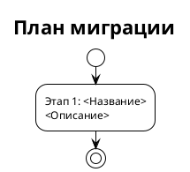

# SYSREQ-<NNN>: <Название документа>

> **Статус:** Черновик / На ревью / Утверждён
> **Автор:** Системный аналитик
> **Дата:** <YYYY-MM-DD>
> **Версия:** 1.0

Альтернативный, более компактный шаблон с Jira-декомпозицией по FR (вместо разделения на Backend/Frontend разделы, как в `ideal_system_requirements.md`).

---

## 1. Введение

### 1.1 Назначение документа

<1-2 предложения: зачем создан этот документ, какую проблему решает.>

### 1.2 Контекст

<Описание ситуации, приведшей к необходимости изменений.>

### 1.3 Термины и определения

| Термин | Определение |
|--------|-------------|
| <Термин 1> | <Определение> |

### 1.4 Ссылки

| Документ | Путь |
|----------|------|
| <Название документа> | `<относительный/путь/к/файлу>` |

---

## 2. Описание текущего состояния (As-Is)

### 2.1 Поток данных / Архитектура

### 2.2 Описание текущего поведения

<Опираться исключительно на анализ кода.>

**Ключевые компоненты:**

| Компонент | Роль | Файл:строка |
|-----------|------|-------------|
| <Имя> | <Что делает> | `<файл>:<строка>` |

---

## 3. Требования

### 3.1 Бизнес-требования

| ID | Требование | Приоритет |
|----|-----------|-----------|
| BR-01 | <Система должна ...> | P0/P1/P2 |

### 3.2 Функциональные требования (Jira-декомпозиция)

Каждое FR — атомарная задача на 1-2 дня. Одна задача = одна карточка в Jira.

---

#### FR-01: <Название задачи> [Оценка: 0.5 дня]

**Jira Title:** `<PROJECT>-<N>: <Краткое название>`

**Требование:** <Чёткое, однозначное описание того, что нужно сделать.>

**Реализация:**

<Конкретные изменения: DDL, код, конфигурация.>

**Обоснование:** <Почему именно так.>

**Затрагиваемые компоненты:**

| Компонент | Тип изменения | Файл:строка |
|-----------|--------------|-------------|
| <Имя> | <ALTER / MODIFY / ADD / DELETE> | `<файл>:<строка>` |

**Критерий приёмки:** <Как QA проверит.>

**Зависимости:** нет / после FR-XX

---

<!-- Повторять блок FR для каждого функционального требования -->

### 3.3 Нефункциональные требования

| ID | Требование | Критерий проверки |
|----|-----------|-------------------|
| NFR-01 | <Производительность / Надёжность / Совместимость> | <Измеримый критерий> |

---

## 4. Целевая архитектура (To-Be)

---

## 5. План миграции

### 5.1 Этапы внедрения

### 5.2 Таблица этапов

| Этап | Действие | Затрагиваемые объекты | Откат |
|------|----------|----------------------|-------|
| 1 | <Описание> | <Список> | <Как откатить> |

### 5.3 Критерии готовности

**Этап 1:** <Как проверить, что этап выполнен корректно.>

---

## 6. Риски и ограничения

### 6.1 Риски

| ID | Риск | Вероятность | Влияние | Митивация |
|----|------|------------|---------|-----------|
| R-01 | <Описание риска> | Низкая / Средняя / Высокая | Низкое / Среднее / Высокое | <Как снизить риск> |

### 6.2 Ограничения

1. <Что данное решение НЕ покрывает.>

---

## 7. Альтернативы (отклонённые)

| Альтернатива | Почему отклонена |
|-------------|-----------------|
| <Описание подхода> | <Обоснование отказа> |

---

## 8. Якоря истины

| Утверждение | Доказательство (файл:строка) |
|-------------|------------------------------|
| <Факт из документа> | `<файл>:<строка>` |
