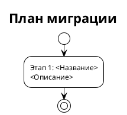

# [СТ] <PROJECT>-<NNN> <Название документа>

> **Пространство:** <Название проекта>
> **Родительская страница:** <Название родительского раздела>

---

## Содержание

1. Введение
   1.1 Общая информация
   1.2 Термины и определения
   1.3 Ссылки
   1.4 История изменений
2. Общее описание
   2.1 Описание текущего поведения (As-Is)
   2.2 Архитектурное решение
   2.3 Диаграмма компонентов
   2.4 Схема последовательности
3. План миграции
   3.1 Этапы внедрения
   3.2 Таблица этапов
   3.3 Критерии готовности
4. Функциональные требования (Backend / БД / API)
   4.1 <Название функционального блока 1>
      4.N <Название задачи N>
         4.N.1 Общее описание
         4.N.2 Обоснование
         4.N.3 Описание доработок
         4.N.4 Затрагиваемые компоненты
         4.N.5 Критерии приёмки
         4.N.6 Зависимости
   4.2 <Название API / сервиса / подсистемы>
      4.N <Название задачи N>
         4.N.1 Общее описание
         4.N.2 Обоснование
         4.N.3 Описание доработок
         4.N.4 Перечень эндпоинтов / Маршрутизация / Источники данных
         4.N.5 Формат ответа (если API)
         4.N.6 Нефункциональные требования
         4.N.7 Затрагиваемые компоненты
         4.N.8 Критерии приёмки
         4.N.9 Зависимости
5. Требования к интерфейсам (Frontend / UI)
   5.1 <Верстка интерфейса экрана "$название_экрана">
      5.N <Название задачи N>
         5.N.1 Общее описание
         5.N.2 Обоснование
         5.N.3 Описание доработок
         5.N.4 Затрагиваемые компоненты
         5.N.5 Критерии приёмки
         5.N.6 Зависимости
   5.2 <Требования к интеграциям на UI>
      5.N <Название задачи N>
         5.N.1 Описание
         5.N.2 Обоснование
         5.N.3 Описание доработок
         5.N.3 Перечень эндпоинтов / Маршрутизация / Источники данных
         5.N.4 Формат ответа (если API)
         5.N.5 Нефункциональные требования
         5.N.6 Затрагиваемые компоненты
         5.N.7 Критерии приёмки
         5.N.8 Зависимости
6. Ревью требований
7. Риски и ограничения
   7.1 Риски
   7.2 Ограничения
8. <Приложения> (опционально)

---

## 1 Введение

### 1.1 Общая информация

| Поле | Значение |
|------|----------|
| Наименование продукта | <Название продукта> |
| Ответственный за продукт | <ФИО> |
| Ответственный за тех. реализацию продукта | <ФИО> |
| Ответственный за документ | <ФИО> |
| Тип продукта и операционная система | <Тип> |
| Epic | <Jira-ссылка> — <Название эпика> |
| БФТ | <Ссылка> — <Название> |
| Аналитика | <Jira-ссылка> — <Название> |
| Статус | Ревью / Утверждён / В работе |

### 1.2 Термины и определения

| Термин | Определение |
|--------|-------------|
| <Термин 1> | <Определение> |

### 1.3 Ссылки

| Документ | Путь / URL |
|----------|------------|
| <Название документа> | `<относительный/путь/к/файлу>` или URL |

### 1.4 История изменений

| Дата | Автор | Суть изменений |
|------|-------|---------------|
| <DD.MM.YYYY> | <ФИО> | Создано описание |

---

## 2 Общее описание

### 2.1 Описание текущего поведения (As-Is)

<Опираться исключительно на анализ кода, не на предположения.>

**Ключевые компоненты:**

| Компонент | Роль | Файл:строка |
|-----------|------|-------------|
| <Имя> | <Что делает> | `<файл>:<строка>` |

### 2.2 Архитектурное решение

<Ссылка на документ с архитектурным решением или краткое описание.>

### 2.3 Диаграмма компонентов

### 2.4 Схема последовательности

---

## 3 План миграции

### 3.1 Этапы внедрения

### 3.2 Таблица этапов

| Этап | Действие | Затрагиваемые объекты | Откат |
|------|----------|----------------------|-------|
| 1 | <Описание> | <Список> | <Как откатить> |

### 3.3 Критерии готовности

**Этап 1:** <Как проверить, что этап выполнен корректно.>

---

## 4 Функциональные требования (Backend / БД / API)

> **Содержимое раздела:** требования к серверной части, базе данных, API, фоновым процессам, интеграциям между сервисами.

### 4.1 <Название функционального блока>

#### 4.N <Название задачи>

| Поле | Значение |
|------|----------|
| Ответственный за тех. реализацию | <ФИО> |
| Задача на разработку | <Jira-ссылка> — <Название> [СТАТУС] |

##### 4.N.1 Общее описание функционала

1. <Описание>

##### 4.N.2 Обоснование

<Почему именно так.>

##### 4.N.3 Затрагиваемые компоненты

| Компонент | Тип изменения | Файл:строка |
|-----------|--------------|-------------|
| <Имя> | <ADD / MODIFY / DELETE / ALTER> | `<файл>:<строка>` |

##### 4.N.4 Критерии приёмки

1. <Проверяемое условие>

##### 4.N.5 Зависимости

нет / после задачи <N.M>

---

## 5 Требования к интерфейсам (Frontend / UI)

> Если документ не содержит UI-изменений — раздел опускается с пометкой «Не применимо».

---

## 6 Ревью требований

| Роль | Исполнитель | Статус |
|------|------------|--------|
| Аналитик (кросс-ревью) | <ФИО> | <Статус> |
| Разработка (Backend) | <ФИО> | <Статус> |
| Разработка (Frontend) | <ФИО> | <Статус> |
| Тестирование | <ФИО> | <Статус> |

---

## 7 Риски и ограничения

### 7.1 Риски

| ID | Риск | Вероятность | Влияние | Митигация |
|----|------|------------|---------|-----------|
| R-01 | <Описание риска> | Низкая / Средняя / Высокая | Низкое / Среднее / Высокое | <Как снизить риск> |

### 7.2 Ограничения

1. <Что данное решение НЕ покрывает.>

---

## Правила заполнения

См. `SKILL.md` в этом же репозитории для полного описания правил заполнения шаблона (разделение Backend/Frontend, нумерация, требования к диаграммам и ссылкам).
